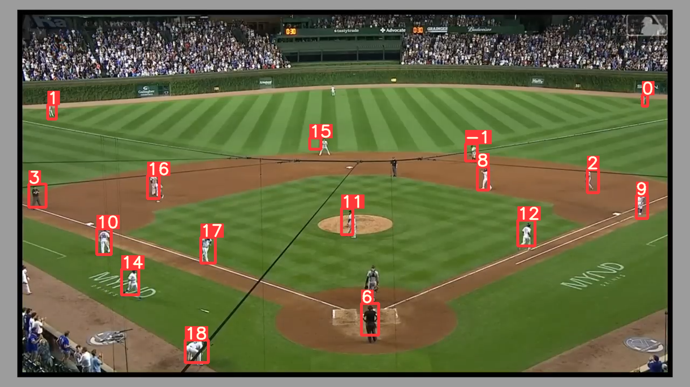
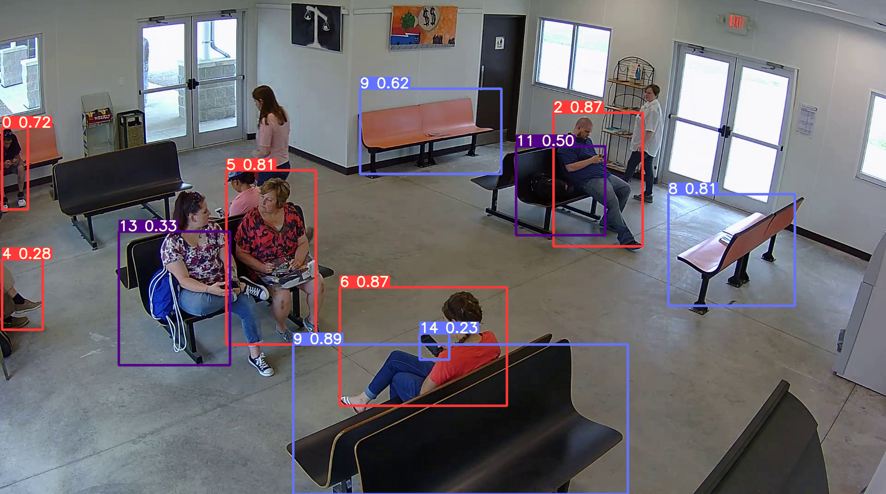

# yolov8-object-tracking
#### Implementation of Yolov8l tracking with tflite in C++


### Phase:
currently make yolov8l tracking integrated with quantized tflite pretrain(finished)
then converst everythiong to C++ to achieve faster speed

### Features
- Object Tracks
- Different Color for every track
- Video/Image/WebCam/External Camera/IP Stream Supported

### Coming Soon
- Selection of specific class ID for tracking
- Development of dashboard for YOLOv8

### Steps to run Code

- Clone the repository
```
https://github.com/yide1235/Yolov8-tracking-tflite-CPP.git
```

### Results
Initial result using yolov8l quantized tflite pretrain model for stereo images(the first index is tracking id, the second is confidence, the color of the box is the class, you can notice this is two frame from a sequence):




### References
- https://github.com/abewley/sort
- https://github.com/ultralytics/ultralytics
- https://github.com/RizwanMunawar/yolov8-object-tracking.git


### C++run command figure out:

//my part dont need tflite
$ g++ -I../tensorflow -ltensorflow_cc -c test.cpp `pkg-config --cflags --libs opencv4`


$ g++ -I../tensorflow -ltensorflow_cc -c test.o `pkg-config --cflags --libs 
opencv4`

g++: warning: test.o: linker input file unused because linking not done


//will only use opencv for the tracking part

