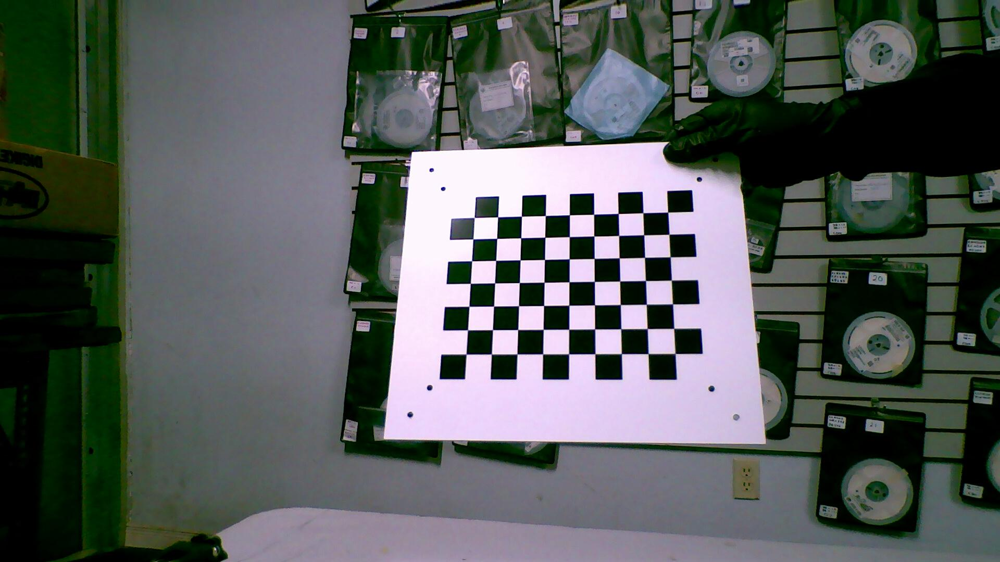
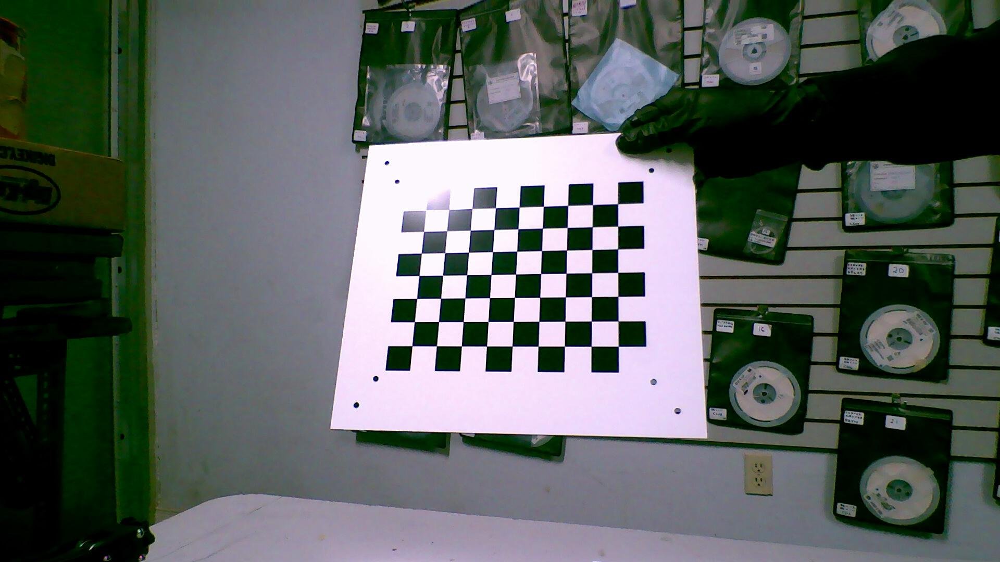
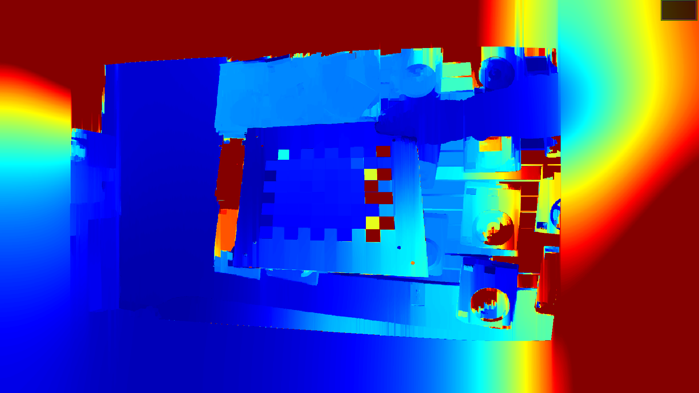
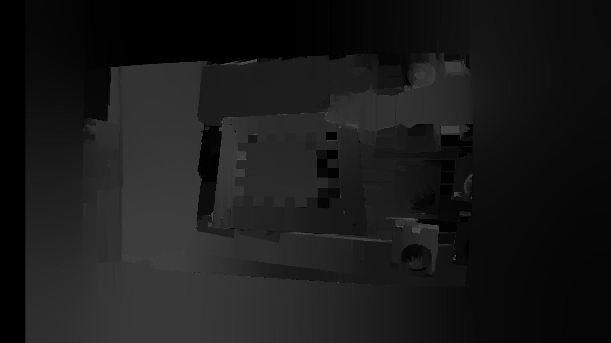

# Viper-camera-pose-estimation-C++

#### Implementation of Yolov8l detection inference, tracking for motion and ssim pair, segmentation, human-part segmentation with tflite in C++

### yolov8_integer -> tracking for ssim and motion -> seg -> pascal-part-seg -> integrate_two_pipline

Yolov8 python inference                             --> ./yolov8python_orign

Yolov8 python/C++ tracking for ssim and motion      --> ./yolov8python_tracking  ./yolov8C++_ssim ./yolov8C++_formotion_detection

Yolov8 python segmentation                          --> ./yolov8python_seg

Yolov8 python segmentation for human part           --> ./py-pascalpart

Install tflite and C++                              --> ./env_install


-------

### Some explain of the tracking for motion detection:
Integerated with video and motion detection, do frame1, frame2, then use frame2 id to do frame2 and frame3
So for ssim, it is the matching algorithm between two images, may need to tune parameter when use.

For seq, just got a new one called yolov8forseq, the yolov8forseq is for motion detection, so for that part
the motion detection should include when a new motion object is coming up and when a normal object is 
tracled as motion, also use the threshold way for motion detection.

-------
### Steps to run Code

- Clone the repository
```
https://github.com/yide1235/Yolov8-tracking-tflite-CPP.git
```
### Results
Initial result using yolov8l quantized tflite pretrain model for stereo images(the first index is tracking id, the second is confidence, the color of the box is the class, you can notice this is two frame from a sequence):

https://github.com/yide1235/Yolov8-tracking-tensorflow-lite-CPP/assets/66981525/530f5db2-8c15-4bbe-bf1e-fc55c073045e

Tracking on video and a pair of image


Human parts segmentation, fine-tune yolov8 to pascal-part


-------

### C++run command figure out:
//help running command
//my part dont need tflite
//$ g++ -I../tensorflow -ltensorflow_cc -c test.cpp `pkg-config --cflags --libs opencv4`
//$ g++ -I../tensorflow -ltensorflow_cc -c test.o `pkg-config --cflags --libs 
opencv4`

-------

### At this project, some linux error I met: 

error: /usr/lib/git-core/git-remote-https: symbol lookup error: /lib/x86_64-linux-gnu/libp11-kit.so.0: undefined symbol: ffi_type_pointer, version LIBFFI_BASE_7.0
solution: 

export LD_LIBRARY_PATH=/content/conda-env/lib:/usr/local/nvidia/lib:/usr/local/nvidia/lib64

-------

//using original yolo repo for inference:

(some env mayhelp: pip install torch==2.0.1
pip install tensorflow==2.13.1 #2.14 will give error

pip install torchaudio==2.0.2+cu118 torchdata==0.6.1 torchtext==0.15.2

pip install torchvision --upgrade

!pip install ultralytics)

yolo export model=yolov8l-seg.pt data=coco128-seg.yaml format=tflite int8

yolo predict model=./yolov8x-seg_int8.tflite source='./download2.png'

-------

Now train it for human part segmentation
Somecode: from ultralytics import YOLO

model_name = 'yolov8l-seg' #@param ["yolov8n-seg", "yolov8s-seg", "yolov8m-seg", "yolov8l-seg", "yolov8x-seg"]
input_width = 640 #@param {type:"slider", min:32, max:4096, step:32}
input_height = 640 #@param {type:"slider", min:32, max:4096, step:32}
optimize_cpu = False

model = YOLO(f"{model_name}.pt") 
model.export(format="tflite", imgsz=[input_height,input_width], optimize=optimize_cpu, int8=True)

//current converts pascal-part to yolo format

//doing the training today

//connect to clearml: !pip install clearml
!pip install clearml>=1.2.0
!clearml-init


//training cli: !yolo task=segment mode=train model=yolov8l-seg.pt data=pascal-part-seg.yaml epochs=300 batch=8

//resume training cli example: !yolo task=segment mode=train resume model=./runs/segment/train6/weights/last.pt data=pascal-part-seg.yaml epochs=200 batch=12 

//new a .py file called train.py and this to retrain:
from ultralytics import YOLO

if __name__ == '__main__':
  
  model = YOLO('./last.pt') # I copied last.pt to the principal folder
  model.resume=True

  results = model.train(
    data='./pascal-part-seg.yaml',
    imgsz=640,
    epochs=500,
    batch=12)

-------

###right now training the first 300 epoch, then last 300 epoch
### testing
source yolov8python/bin/activate
yolo predict model=./last.pt source='./tmpr21.png' hide_labels=True boxes=False

-------

### Runing:
first run background removal then humanpart segmentation
or should run in one inference

### New update:
wont use segmentation+pca for pose
just use average of pose

### To check how to install tflite on C++, like rebuild tflite with C++, check here:
https://github.com/karthickai/tflite.git

### for code from yolov8C++_motion_detection: function like this should be modified:
void generateIds(std::vector<std::vector<float>>* results) {
    for (int i = 0; i < (*results).size(); ++i) {
      (*results)[i].push_back(0.0);
      (*results)[i].push_back(static_cast<float>(i));
      (*results)[i].push_back(-1.0);
      (*results)[i].push_back(0.0);
    }
    
}
//so instead of using (*results), just use results, so the modified version:
void generateIds(std::vector<std::vector<float>>& results) {
    for (int i = 0; i < (results).size(); ++i) {
      (results)[i].push_back(0.0);
      (results)[i].push_back(static_cast<float>(i));
      (results)[i].push_back(-1.0);
      (results)[i].push_back(0.0);
    }
    
}

//this make cause error, but it is fixed at yolov8C++_ssim

# so the results for depth:






### References
- https://github.com/abewley/sort
- https://github.com/ultralytics/ultralytics
- https://github.com/RizwanMunawar/yolov8-object-tracking.git


